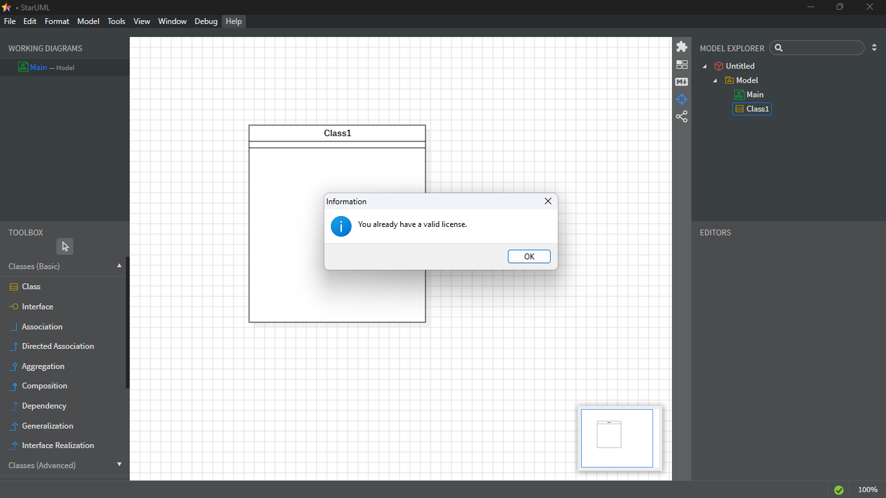

# StarUML Full License

## 1. Descargar StarUML

Descarga StarUML desde [la página oficial](https://staruml.io/download).

## 2. Descargar Node.js

Descarga Node.js desde [su página oficial](https://nodejs.org/es/download/).

## 3. Ejecutar la terminal como administrador

Abre **Git Bash**, **PowerShell** o **CMD** como administrador.

## 4. Instalar `asar`

Ejecuta el siguiente comando:

```bash
npm install -g asar
```

## 5. Navegar a la carpeta de instalación de StarUML

Ejecuta:

```bash
cd "C:/Program Files/StarUML/resources"
```

## 6. Descomprimir `app.asar`

Ejecuta:

```bash
asar extract app.asar app
```

Esto creará una carpeta llamada `app` en la misma ubicación que `app.asar`.

## 7. Abrir el archivo `license-manager.js`

Ejecuta:

```bash
code app/src/engine/license-manager.js
```

Esto abrirá el archivo en **Visual Studio Code** (puedes usar cualquier editor de tu preferencia).

## 8. Modificar `license-manager.js`

Busca la función `checkLicenseValidity()` y reemplaza su contenido con:

```javascript
async checkLicenseValidity() {
    // En lugar de validar la licencia, establezca siempre el estado en verdadero
    setStatus(this, true);
}
```

## 9. Modificar `diagram-export.js` para exportar diagramas en alta calidad

Ejecuta:

```bash
code app/src/diagram-export.js
```

Copia y pega el siguiente código:

```javascript
const fs = require("fs-extra");
const filenamify = require("filenamify");
const PDFDocument = require("pdfkit");
const { Point, ZoomFactor, Canvas } = require("../core/graphics");
const { PDFCanvas } = require("./pdf-graphics");
const { Context } = require("svgcanvas");

const BOUNDING_BOX_EXPAND = 10;

const PDF_MARGIN = 30;
const PDF_DEFAULT_ZOOM = 1; // Default Zoom Level

/**
 * @private
 * Get Base64-encoded image data of diagram
 * @param {Editor} editor
 * @param {string} type (e.g. 'image/png')
 * @return {string}
 */
function getImageData(diagram, type) {
  // Crear un nuevo canvas para generar la imagen
  var canvasElement = document.createElement("canvas");
  var canvas = new Canvas(canvasElement.getContext("2d"));
  var boundingBox = diagram.getBoundingBox(canvas);

  // Initialize new canvas
  // Expandir el boundingBox para asegurar que se incluya todo el diagrama
  boundingBox.expand(BOUNDING_BOX_EXPAND);
  // Ajustar el origen del canvas para no recortar el diagrama
  canvas.origin = new Point(-boundingBox.x1, -boundingBox.y1);
  canvas.zoomFactor = new ZoomFactor(1, 1);
  // Aquí calculamos el tamaño real del canvas antes de aplicar la relación de píxeles
  canvasElement.width = boundingBox.getWidth(); // Anchura real
  canvasElement.height = boundingBox.getHeight(); // Altura real

  // Configuración para pantallas de alta DPI (Retina)
  if (window.devicePixelRatio) {
    var ratio = window.devicePixelRatio * 2; // Ajustar el ratio para alta calidad
    canvasElement.width *= ratio; // Aumentar la anchura según el ratio
    canvasElement.height *= ratio; // Aumentar la altura según el ratio
    canvas.context.scale(ratio, ratio); // Escalar el contexto del canvas
  }

  // Dibujar un fondo blanco solo para JPEG (para evitar el fondo transparente)
  if (type === "image/jpeg") {
    canvas.context.fillStyle = "#ffffff";
    canvas.context.fillRect(0, 0, canvasElement.width, canvasElement.height);
  }

  // Dibujar el diagrama en el nuevo canvas
  diagram.arrangeDiagram(canvas);
  diagram.drawDiagram(canvas);

  // Devolver los datos del canvas en base64
  var data = canvasElement
    .toDataURL(type, 1.0)
    .replace(/^data:image\/(png|jpeg);base64,/, "");
  return data;
}

/**
 * @private
 * Get SVG image data of editor.diagram
 * @param {Diagram} diagram
 * @return {string}
 */
function getSVGImageData(diagram) {
  const boundingBox = diagram.getBoundingBox(canvas);
  boundingBox.expand(BOUNDING_BOX_EXPAND);
  const w = boundingBox.getWidth();
  const h = boundingBox.getHeight();

  // Make a new SVG canvas for making SVG image data
  var ctx = new Context(w, h);
  var canvas = new Canvas(ctx);

  // Initialize new SVG Canvas
  canvas.origin = new Point(-boundingBox.x1, -boundingBox.y1);
  canvas.zoomFactor = new ZoomFactor(2, 2); // Aplicamos un zoom adicional para mayor calidad

  // Draw diagram to the new SVG Canvas
  diagram.arrangeDiagram(canvas);
  diagram.drawDiagram(canvas);

  // Return the SVG data
  var data = ctx.getSerializedSvg(true);
  return data;
}

/**
 * @private
 * Export Diagram as PNG
 *
 * @param {Diagram} diagram
 * @param {string} fullPath
 */
function exportToPNG(diagram, fullPath) {
  diagram.deselectAll();
  var data = getImageData(diagram, "image/png");
  var buffer = Buffer.from(data, "base64");
  fs.writeFileSync(fullPath, buffer);
}

/**
 * @private
 * Export Diagram as JPEG
 *
 * @param {Diagram} diagram
 * @param {string} fullPath
 */
function exportToJPEG(diagram, fullPath) {
  diagram.deselectAll();
  var data = getImageData(diagram, "image/jpeg");
  var buffer = Buffer.from(data, "base64");
  fs.writeFileSync(fullPath, buffer);
}

/**
 * @private
 * Export Diagram as SVG
 *
 * @param {Diagram} diagram
 * @param {string} fullPath
 */
function exportToSVG(diagram, fullPath) {
  diagram.deselectAll();
  var data = getSVGImageData(diagram);
  fs.writeFileSync(fullPath, data, "utf8");
}

/**
 * @private
 * Export a list of diagrams
 *
 * @param {string} format One of `png`, `jpg`, `svg`.
 * @param {Array<Diagram>} diagrams
 * @param {string} basePath
 */
function exportAll(format, diagrams, basePath) {
  if (diagrams && diagrams.length > 0) {
    const path = basePath + "/" + format;
    fs.ensureDirSync(path);
    diagrams.forEach((diagram, idx) => {
      var fn =
        path +
        "/" +
        filenamify(diagram.getPathname()) +
        "_" +
        idx +
        "." +
        format;
      switch (format) {
        case "png":
          return exportToPNG(diagram, fn);
        case "jpg":
          return exportToJPEG(diagram, fn);
        case "svg":
          return exportToSVG(diagram, fn);
      }
    });
  }
}

function drawWatermarkPDF(doc, xstep, ystep, text) {
  doc.font("Helvetica");
  doc.fontSize(8);
  doc.fillColor("#eeeeee");
  for (var i = 0, wx = doc.page.width; i < wx; i += xstep) {
    for (var j = 0, wy = doc.page.height; j < wy; j += ystep) {
      doc.text(text, i, j, { lineBreak: false });
    }
  }
}

/**
 * @private
 * Export diagrams to a PDF file
 * @param{Array<Diagram>} diagrams
 * @param{string} fullPath
 * @param{Object} options
 */
function exportToPDF(diagrams, fullPath, options) {
  var doc = new PDFDocument(options);
  for (var name in app.fontManager.files) {
    const path = app.fontManager.files[name];
    doc.registerFont(name, path);
  }
  doc.pipe(fs.createWriteStream(fullPath));
  var i, len;
  for (i = 0, len = diagrams.length; i < len; i++) {
    var canvas = new PDFCanvas(doc);
    if (i > 0) {
      doc.addPage(options);
    }
    var diagram = diagrams[i];
    var box = diagram.getBoundingBox(canvas);
    var w = doc.page.width - PDF_MARGIN * 2;
    var h = doc.page.height - PDF_MARGIN * 2;
    var zoom = Math.min(w / box.x2, h / box.y2);
    canvas.baseOrigin.x = PDF_MARGIN;
    canvas.baseOrigin.y = PDF_MARGIN;
    canvas.baseScale = Math.min(zoom, PDF_DEFAULT_ZOOM);

    diagram.arrangeDiagram(canvas);
    diagram.drawDiagram(canvas, false);

    if (options.showName) {
      doc.fontSize(10);
      doc.font("Helvetica");
      canvas.textOut(0, -10, diagram.getPathname());
    }
  }
  doc.end();
}

exports.getImageData = getImageData;
exports.getSVGImageData = getSVGImageData;
exports.exportToPNG = exportToPNG;
exports.exportToJPEG = exportToJPEG;
exports.exportToSVG = exportToSVG;
exports.exportAll = exportAll;
exports.exportToPDF = exportToPDF;
```

## 10. Reempaquetar `app.asar`

Ejecuta:

```bash
asar pack app app.asar
```

## 11. Eliminar la carpeta `app`

Esta carpeta ya no es necesaria, así que puedes eliminarla.

Ejecuta:

```bash
rmdir /s /q app
```

## **¡Listo!**

Ahora puedes abrir StarUML sin el aviso de licencia y exportar diagramas en alta calidad sin marca de agua.



> [!NOTE]  
> Puedes ejecutar el script en Powershell que hace todo esto automáticamente
> [Descargar](https://raw.githubusercontent.com/RicardoAndrex9/staruml-full-license/refs/heads/main/script-license.ps1?token=GHSAT0AAAAAADBYYQIJPVGWQHDUQMWRESIYZ75OXOQ)
